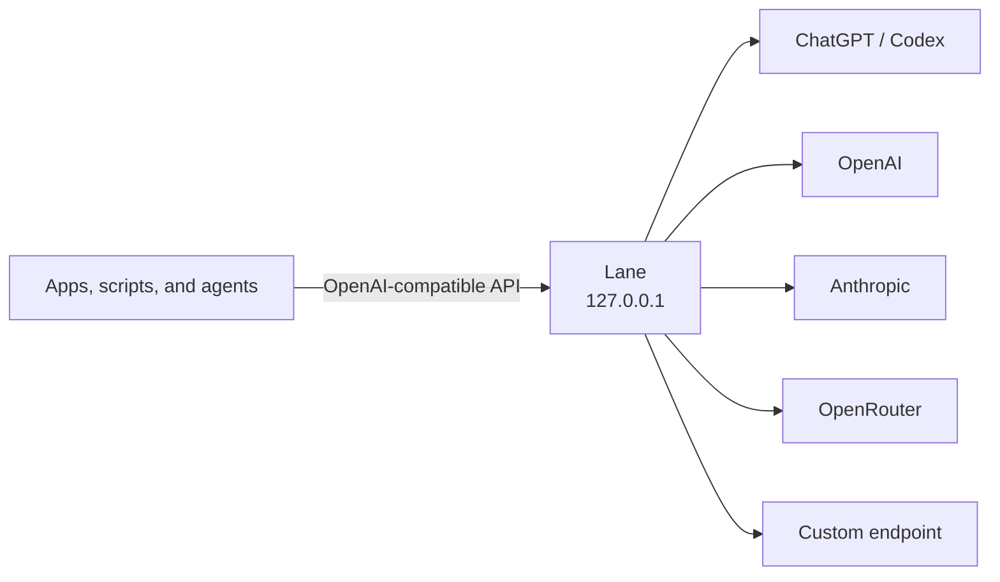

<p align="center">
  
</p>

<h1 align="center">Lane</h1>

<p align="center">
  <strong>Your AI providers. One private local API.</strong>
</p>

<p align="center">
  A macOS desktop gateway for apps, scripts, and agents.
</p>

<p align="center">
  <a href="https://github.com/1MoreBuild/Lane/releases"><strong>Download the macOS preview →</strong></a>
</p>

<p align="center">
  
</p>

Lane turns the AI accounts you already use into one OpenAI-compatible endpoint
on your Mac. Sign in with ChatGPT / Codex OAuth or add a provider key once, then
use the same local URL from desktop apps, browser extensions, scripts, and
agents.

Credentials stay in the operating system's secure storage. Clients receive a
separate Lane key, never your provider API key or OAuth token.

Lane is a gateway, not an agent. It does not add hidden instructions, run an
agent loop, or execute tool calls.

## Why Lane

- **Connect once.** Use ChatGPT / Codex, OpenAI, Anthropic, OpenRouter, or a
  custom OpenAI-compatible endpoint.
- **Use one API.** Switch providers without teaching every client a new
  protocol.
- **Keep control local.** Lane listens only on `127.0.0.1` and requires a random
  client key.
- **Use chat and images.** Route text requests and supported image-generation
  models through the same gateway.
- **Work your way.** Control Lane from its desktop app, menu bar, or optional
  `lane` command.

## Download

Lane is currently a developer preview. The macOS builds are unsigned and meant
for early testing.

| Mac | Download |
| --- | --- |
| Apple Silicon (M1 or newer) | `Lane-…-mac-arm64.dmg` |
| Intel | `Lane-…-mac-x64.dmg` |

Download the right DMG from [GitHub Releases](https://github.com/1MoreBuild/Lane/releases),
then follow the [unsigned-build installation guide](docs/TEST_BUILDS.md). Never
disable Gatekeeper globally.

## Get started

1. Open Lane.
2. Choose **Add provider** and connect an account.
3. Select a default chat model and, when available, an image model.
4. Copy the API base URL and Lane client key into your client.

Transly connects automatically through Chrome Native Messaging, without copying
an endpoint, client key, or model name.

| Connection | Authentication | Current support |
| --- | --- | --- |
| ChatGPT / Codex | Browser OAuth | Chat models and `gpt-image-2` |
| OpenAI | API key | Models returned by your OpenAI account |
| Anthropic | API key | Chat models |
| OpenRouter | API key | Chat and supported image models |
| Custom endpoint | Base URL and API key | OpenAI-compatible chat and identifiable image models |

## Use the API

Lane exposes an OpenAI-compatible API at `http://127.0.0.1:3210/v1`.

```bash
curl http://127.0.0.1:3210/v1/models \
  -H "Authorization: Bearer $LANE_CLIENT_KEY"
```

```bash
curl http://127.0.0.1:3210/v1/chat/completions \
  -H "Authorization: Bearer $LANE_CLIENT_KEY" \
  -H "Content-Type: application/json" \
  -d '{
    "model": "openai-codex/gpt-5.6-sol",
    "messages": [{"role": "user", "content": "Say hello in one sentence."}]
  }'
```

```bash
curl http://127.0.0.1:3210/v1/images/generations \
  -H "Authorization: Bearer $LANE_CLIENT_KEY" \
  -H "Content-Type: application/json" \
  -d '{
    "model": "openai-codex/gpt-image-2",
    "prompt": "A minimal black-and-white lane icon",
    "quality": "low",
    "size": "1024x1024"
  }'
```

| Method | Route | Purpose |
| --- | --- | --- |
| `GET` | `/health` | Gateway status |
| `GET` | `/v1/models` | Normalized chat and image models |
| `POST` | `/v1/responses` | Responses API, streaming or JSON |
| `POST` | `/v1/chat/completions` | Chat Completions, streaming or JSON |
| `POST` | `/v1/images/generations` | One-shot image generation |

Lane passes function definitions, calls, and outputs back to the client. It
never executes tools.

## Use the CLI

The packaged macOS app can install a small `lane` command. In **Settings**,
choose **Install command line tool…**. macOS asks for administrator authorization
once.

```bash
lane status
lane start
lane stop
lane connection
lane providers list
lane models
lane activity
lane open
```

Commands also support stable machine-readable output:

```bash
lane status --json --no-input
lane connection --json --no-input
lane schema --json --no-input
```

Agents can configure API-key providers without placing secrets in process
arguments or shell history:

```bash
printf '%s\n' "$OPENAI_API_KEY" |
  lane providers add \
    --kind openai \
    --name OpenAI \
    --api-key-stdin \
    --json \
    --no-input

lane providers remove --id PROVIDER_ID --force --json --no-input
lane models set-default --id PROVIDER_ID/MODEL_ID --json --no-input
lane models set-default-image --id PROVIDER_ID/IMAGE_MODEL_ID --json --no-input
```

`lane connection` returns the local API URL, routes, and Lane client key. Stored
provider API keys are write-only. OAuth tokens are never returned.
`lane providers login` can start ChatGPT / Codex sign-in, but the user must
complete the browser flow.

## How it works



Lane uses
[`@earendil-works/pi-ai`](https://github.com/earendil-works/pi/tree/main/packages/ai)
directly as its model and provider layer. It does not depend on
`pi-coding-agent`.

## Security

- The gateway always binds to `127.0.0.1`; no setting can expose it on the LAN.
- Every API request requires a random Lane client key.
- Browser origins must match an allowlist. Wildcard CORS is not allowed.
- Provider credentials and OAuth tokens remain in Electron's main process.
- Secrets use Electron `safeStorage`, backed by Keychain on macOS and the
  equivalent secure facility on supported platforms.
- Logs exclude prompts, responses, request bodies, headers, credentials, and
  complete tokens.
- Daily activity logs are kept for 7 days and capped at 5 MiB.

The Lane client key is visible because local clients need it. Treat it like a
password. See the [threat model](docs/THREAT_MODEL.md) for the full boundary.

Lane registers a Chrome Native Messaging host for Transly when the packaged app
starts. Only explicitly allowlisted Transly extension IDs can call it. Wildcards
are never accepted. The host returns the Lane URL, client key, and public model
list; it never returns a provider API key or OAuth token.

## Compatibility

Lane implements the common OpenAI API subset listed above. It is not a complete
OpenAI platform emulator. Audio, files, hosted tools, image editing, and partial
image streaming are outside the current compatibility promise.

ChatGPT / Codex uses the provider-owned OAuth implementation in `pi-ai` and
requires an eligible ChatGPT subscription. This is a community integration, not
an OpenAI stability guarantee: scopes, endpoints, models, and subscription
policy can change upstream.

`gpt-image-2` can generate images through ChatGPT / Codex OAuth, but native
transparent output is not supported and exact pixel size is best effort. Lane
rejects `background: "transparent"` for that model rather than returning an
opaque image that only looks transparent. Use a compatible OpenAI API-key model
when native alpha is required.

Automated tests use mocks and never send paid generation requests. Real OAuth
login and model use remain explicit user actions.

## Develop

Requirements: Node.js 24 LTS and npm.

```bash
git clone https://github.com/1MoreBuild/Lane.git
cd Lane
npm install
npm run dev
```

Run the complete local check:

```bash
npm run check
```

Build and smoke-test Apple Silicon:

```bash
npm run package:mac:arm64
npm run smoke:mac
npm run smoke:cli:mac
LANE_SMOKE_ARCH=arm64 npm run smoke:dmg:mac
```

Use `npm run package:mac:x64` for the Intel DMG. Windows NSIS targets for x64
and arm64 are configured, and CI runs build checks on `windows-latest`. Windows
runtime behavior has not yet been verified on a Windows host.

## Documentation

- [Architecture](docs/ARCHITECTURE.md)
- [Threat model](docs/THREAT_MODEL.md)
- [Release checklist](docs/RELEASING.md)
- [Third-party notices](THIRD_PARTY_NOTICES.md)

Lane is an independent project and is not part of Transly.

## License

[MIT](LICENSE) © 2026 Lane contributors
