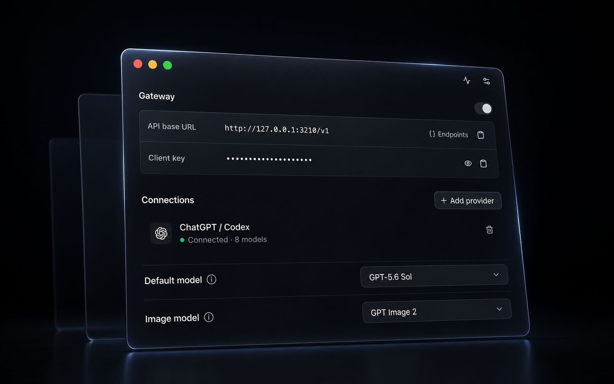

<p align="center">
  
</p>

<h1 align="center">Lane</h1>

<p align="center">
  <strong>Your AI providers. One private local API.</strong>
</p>

<p align="center">
  Connect apps, scripts, and agents to the AI accounts you already use.
</p>

<p align="center">
  <a href="https://github.com/1MoreBuild/Lane/releases/latest"></a>
  <a href="https://github.com/1MoreBuild/Lane/actions/workflows/ci.yml"></a>
  <a href="./LICENSE"></a>
</p>

<p align="center">
  <a href="https://github.com/1MoreBuild/Lane/releases/latest"><strong>Download Lane for macOS →</strong></a>
</p>

<p align="center">
  
</p>

Lane turns the AI providers you already use into one OpenAI-compatible API on
your Mac. Sign in to ChatGPT / Codex with OAuth or add a provider API key, then
connect any local client to Lane.

Lane is a gateway, not an agent. It does not add hidden instructions, run an
agent loop, or execute tool calls.

## Why Lane

- One loopback API for ChatGPT / Codex, OpenAI, Anthropic, OpenRouter, and
  custom OpenAI-compatible endpoints.
- Responses, Chat Completions, image generation, streaming, and image input.
- Keychain-backed provider credentials that never enter the renderer or local
  API responses.
- A separate Lane client key, explicit browser-origin allowlists, and a gateway
  fixed to `127.0.0.1`.
- Redacted persistent activity plus optional session-only request capture for
  local debugging.
- Desktop, menu bar, CLI, and user-confirmed automatic updates.

## Install

Download the current DMG from
[GitHub Releases](https://github.com/1MoreBuild/Lane/releases/latest):

| Mac | Download |
| --- | --- |
| Apple Silicon | `Lane-…-mac-arm64.dmg` |
| Intel | `Lane-…-mac-x64.dmg` |

Lane's stable macOS releases are Developer ID signed, notarized by Apple, and
tested after installation on native Apple Silicon and Intel runners. Drag Lane
to Applications and open it normally.

## Start in three steps

1. Open Lane and add a provider.
2. Choose the default model, reasoning effort, speed, and image model.
3. Copy the API base URL and Lane client key into your client.

Test the connection:

```bash
curl http://127.0.0.1:3210/v1/models \
  -H "Authorization: Bearer $LANE_CLIENT_KEY"
```

Lane supports `/v1/responses`, `/v1/chat/completions`, and
`/v1/images/generations`. Text responses can stream, and vision-capable models
accept base64 data URL image inputs. Tool calls are returned to the client;
Lane never executes them.

Lane defaults reasoning effort to High and speed to Standard. Requests can
override those defaults with `reasoning.effort` / `reasoning_effort` and
`service_tier`.

| Provider | Connection |
| --- | --- |
| ChatGPT / Codex | Browser OAuth |
| OpenAI | API key |
| Anthropic | API key |
| OpenRouter | API key |
| Custom OpenAI-compatible endpoint | Base URL and API key |

ChatGPT / Codex support is a community integration built on
[`pi-ai`](https://github.com/earendil-works/pi/tree/main/packages/ai).
Upstream scopes, endpoints, models, and subscription policy can change.

## CLI for local agents

Install the `lane` command from **Settings**. Agents can inspect and control the
gateway through stable JSON output without reading provider OAuth tokens.

```bash
lane status --json --no-input
lane connection --json --no-input
lane models
lane models set-effort --effort high
lane models set-speed --speed fast
lane start
lane stop
```

Run `lane schema --json --no-input` for the complete command contract.

## Develop

Lane requires Node.js 24 LTS and npm.

```bash
git clone https://github.com/1MoreBuild/Lane.git
cd Lane
npm install
npm run dev
```

Run `npm run check` for linting, type checking, contract tests, and packaging
validation. Packaged-product E2E is the product baseline; see `AGENTS.md` for
the platform commands and test policy.

## Documentation

- [Changelog](CHANGELOG.md)
- [Architecture](docs/ARCHITECTURE.md)
- [Threat model](docs/THREAT_MODEL.md)
- [Release process](docs/RELEASING.md)
- [Unsigned test builds](docs/TEST_BUILDS.md)

## License

[MIT](LICENSE) • Haitian ([1MoreBuild](https://github.com/1MoreBuild))
