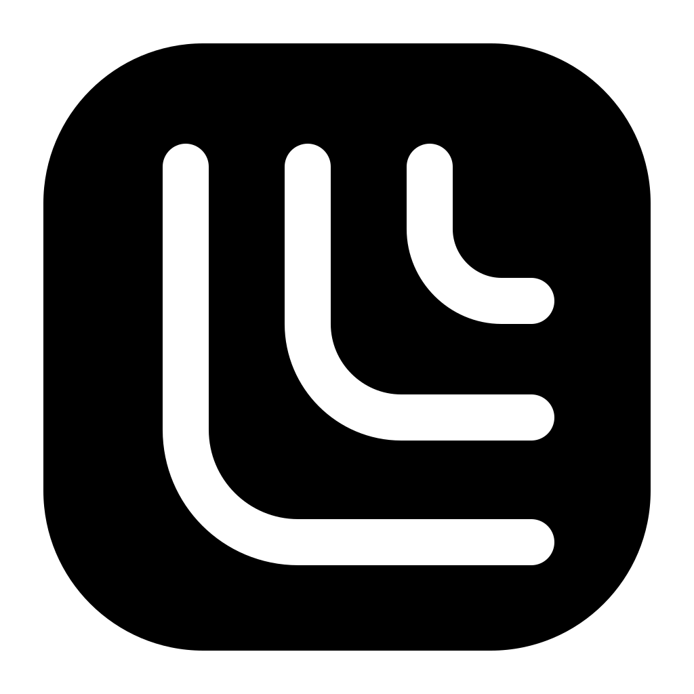
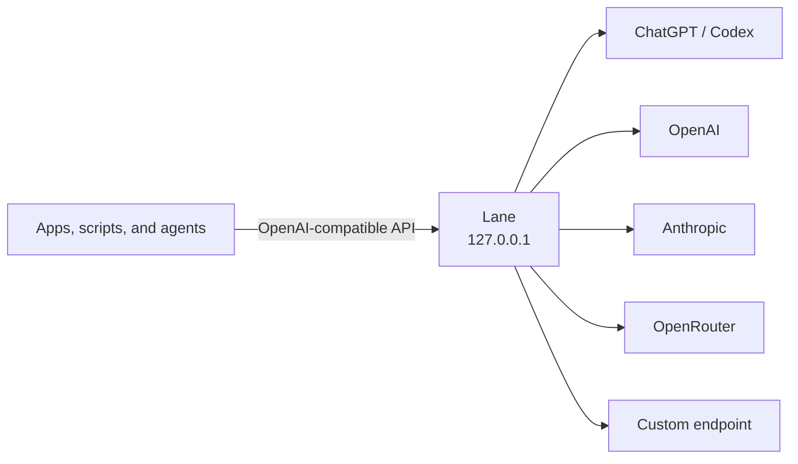

<p align="center">
  
</p>

<h1 align="center">Lane</h1>

<p align="center">
  One private local endpoint for the AI providers you already use.
</p>

<p align="center">
  <a href="https://github.com/1MoreBuild/Lane/actions/workflows/ci.yml"></a>
  <a href="./LICENSE"></a>
  
  
</p>

Lane connects desktop apps, scripts, and agents to multiple AI providers through
one OpenAI-compatible API on your computer. Provider credentials stay in the
operating system's secure storage. Clients receive only a separate Lane key.

Lane is a gateway, not an agent. It does not add hidden instructions, run an
agent loop, or execute tool calls.



## Connect once. Use anywhere.

- **One local API.** Switch providers without teaching every client a new
  protocol.
- **OAuth and API keys.** Use ChatGPT / Codex sign-in or connect your own
  provider key.
- **Chat and images.** Route text requests and supported image-generation
  models through the same gateway.
- **Private by default.** Lane is fixed to `127.0.0.1`, requires a random client
  key, and never exposes upstream credentials to clients.
- **Built for people and agents.** Control Lane from the desktop, menu bar, or
  the optional `lane` command.

| Connection | Authentication | Current support |
| --- | --- | --- |
| ChatGPT / Codex | Browser OAuth | Chat models and `gpt-image-2` |
| OpenAI | API key | Models returned by your OpenAI account |
| Anthropic | API key | Chat models |
| OpenRouter | API key | Chat and supported image models |
| Custom endpoint | Base URL and API key | OpenAI-compatible chat and identifiable image models |

## Get started

> Lane is currently a developer preview. The macOS build is unsigned and is
> intended for local testing, not public distribution.

1. Start Lane with `npm run dev`, or open a locally packaged build.
2. Choose **Add provider** and connect an account.
3. Select the default chat model and, when available, an image model.
4. Start the gateway.
5. Copy the API base URL and Lane client key into your client.

Check the connection:

```bash
curl http://127.0.0.1:3210/v1/models \
  -H "Authorization: Bearer $LANE_CLIENT_KEY"
```

Send a chat request:

```bash
curl http://127.0.0.1:3210/v1/chat/completions \
  -H "Authorization: Bearer $LANE_CLIENT_KEY" \
  -H "Content-Type: application/json" \
  -d '{
    "model": "openai-codex/gpt-5.6-sol",
    "messages": [{"role": "user", "content": "Say hello in one sentence."}]
  }'
```

Generate an image:

```bash
curl http://127.0.0.1:3210/v1/images/generations \
  -H "Authorization: Bearer $LANE_CLIENT_KEY" \
  -H "Content-Type: application/json" \
  -d '{
    "model": "openai-codex/gpt-image-2",
    "prompt": "A minimal black-and-white lane icon",
    "quality": "low",
    "size": "1024x1024"
  }'
```

## OpenAI-compatible API

| Method | Route | Purpose |
| --- | --- | --- |
| `GET` | `/health` | Gateway status |
| `GET` | `/v1/models` | Normalized chat and image models |
| `POST` | `/v1/responses` | Responses API, streaming or JSON |
| `POST` | `/v1/chat/completions` | Chat Completions, streaming or JSON |
| `POST` | `/v1/images/generations` | One-shot image generation |

The first release supports text conversations, system and developer
instructions, function definitions, function calls, and function outputs. Tool
calls are passed back to the client; Lane never executes them.

## Command line for local agents

The packaged macOS app can install a small `lane` command. In **Settings**,
choose **Install command line tool…**. macOS asks for administrator authorization
once to add the launcher to your command path.

```bash
lane status
lane start
lane stop
lane connection
lane providers list
lane models
lane activity
lane open
```

Commands support stable machine-readable output:

```bash
lane status --json --no-input
lane connection --json --no-input
lane schema --json --no-input
```

An agent can add, remove, and configure API-key providers without putting a
secret in process arguments or shell history:

```bash
printf '%s\n' "$OPENAI_API_KEY" |
  lane providers add \
    --kind openai \
    --name OpenAI \
    --api-key-stdin \
    --json \
    --no-input

lane providers remove --id PROVIDER_ID --force --json --no-input
lane models set-default --id PROVIDER_ID/MODEL_ID --json --no-input
lane models set-default-image --id PROVIDER_ID/IMAGE_MODEL_ID --json --no-input
```

`lane connection` returns the local API base URL, routes, and Lane client key so
an authorized local agent can call the gateway. Stored provider API keys are
write-only. OAuth tokens are never returned. `lane providers login` can start
ChatGPT / Codex sign-in, but the user must complete the browser flow.

## Security model

- The gateway always binds to `127.0.0.1`; no setting can expose it on the LAN.
- Every API request requires a random Lane client key.
- Browser origins must match an allowlist. Wildcard CORS is not allowed.
- Provider credentials and OAuth tokens remain in Electron's main process.
- Secrets use Electron `safeStorage`, backed by Keychain on macOS and the
  equivalent secure facility on supported platforms.
- Logs are redacted before they reach disk. Lane never logs prompts, responses,
  request bodies, headers, or credentials.
- Daily activity logs are retained for 7 days and capped at 5 MiB.

The Lane client key is visible because local clients need it. Treat it like a
password. Read the [threat model](docs/THREAT_MODEL.md) for the full boundary.

## Compatibility boundary

Lane implements the common OpenAI API subset listed above; it is not a complete
OpenAI platform emulator. Audio, files, hosted tools, image editing, and partial
image streaming are outside the current compatibility promise.

ChatGPT / Codex uses the provider-owned OAuth implementation in
[`@earendil-works/pi-ai`](https://github.com/earendil-works/pi/tree/main/packages/ai).
It requires an eligible ChatGPT subscription. This is a community integration,
not an OpenAI stability guarantee: scopes, endpoints, models, and subscription
policy can change upstream.

`gpt-image-2` can generate images through ChatGPT / Codex OAuth, but native
transparent output is not supported and exact pixel size is best effort. Lane
rejects `background: "transparent"` for that model rather than returning an
opaque image that only looks transparent. Use a compatible OpenAI API-key model
when native alpha is required.

Automated tests use mocks and never send paid generation requests. Real OAuth
login and real model use remain explicit user actions.

## Develop

Requirements: Node.js 24 LTS and npm.

```bash
git clone https://github.com/1MoreBuild/Lane.git
cd Lane
npm install
npm run dev
```

Run the complete local check:

```bash
npm run check
```

Build and smoke-test on macOS:

```bash
npm run package:mac
npm run smoke:mac
npm run smoke:cli:mac
```

Windows NSIS targets for x64 and arm64 are configured, and CI runs build checks
on `windows-latest`. Windows runtime behavior has not yet been verified on a
Windows host.

Lane uses `@earendil-works/pi-ai` directly as its model and provider layer. It
does not depend on `pi-coding-agent`.

## Project documentation

- [Architecture](docs/ARCHITECTURE.md)
- [Threat model](docs/THREAT_MODEL.md)
- [Release checklist](docs/RELEASING.md)
- [Third-party notices](THIRD_PARTY_NOTICES.md)

Lane is an independent project and is not part of Transly.

## License

[MIT](LICENSE) © 2026 Lane contributors
